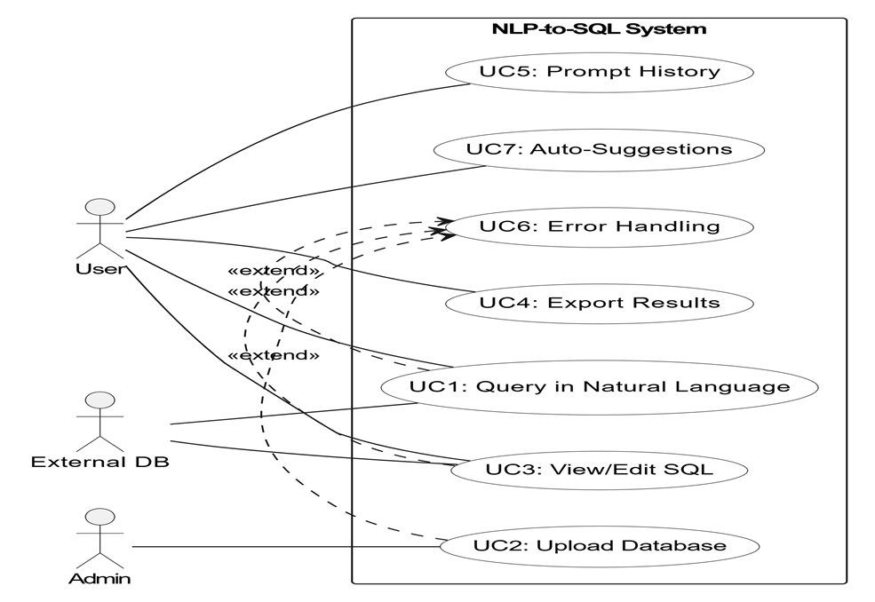
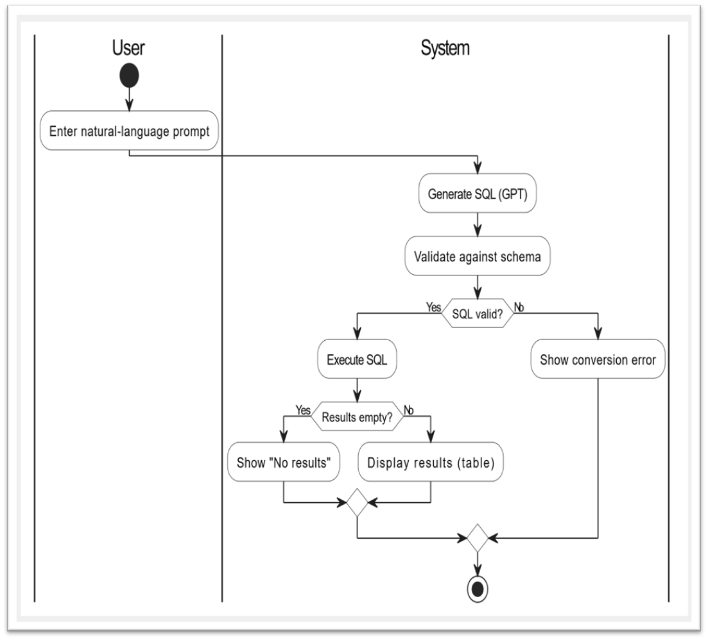
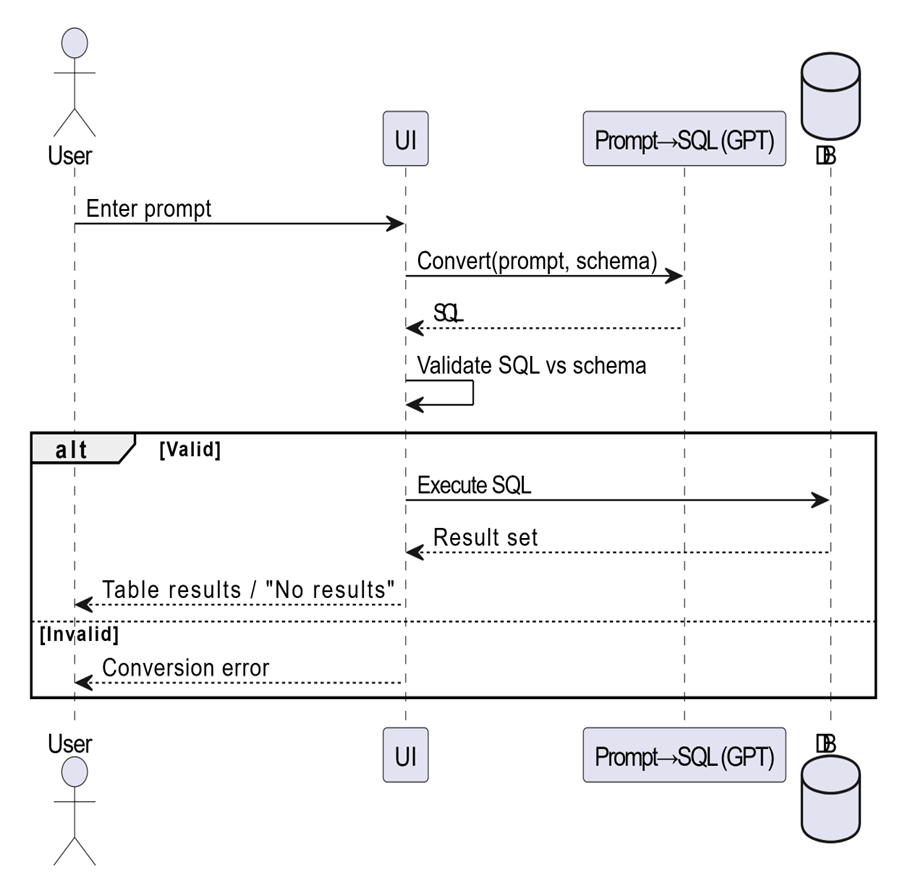

# 🌟 Dell–Tsofen Project: Use Cases & User Stories  

---

## 1. Introduction  
This document describes the use cases and user stories for the **Dell–Tsofen Natural Language to SQL tool**.  
It aims to provide clear, formal, and structured documentation of system interactions, supported by diagrams and flows.  

---

## 2. Actors  

- **User (Analyst/Employee):** Interacts with the system by entering natural language queries, viewing results, and exporting them.  
- **System:** Converts natural language into SQL, validates and executes queries, and displays results.  
- **Database:** Stores the data and executes SQL queries.  
- **Admin (optional):** Validates uploaded database files, monitors errors.  

---

## 3. Use Cases  

### UC1 – Query Data in Natural Language  
**Actor:** User  
**Goal:** Retrieve data by asking a question in plain English.  
**Precondition:** A valid database is uploaded.  

**Main Flow:**  
1. User enters a natural language prompt.  
2. System converts it to SQL.  
3. System validates SQL against schema.  
4. System executes SQL and returns tabular results.  

**Alternative Flows:**  
- 3a. SQL cannot be generated → error message.  
- 3b. SQL query fails → error message.  

**Postcondition:** User sees results or an error.  

---

### UC2 – Upload Database File  
**Actor:** User/Admin  
**Goal:** Provide database for querying.  
**Precondition:** User has a `.db` file.  

**Main Flow:**  
1. User selects/uploads database file.  
2. System validates file type.  
3. System loads database schema.  

**Alternative Flows:**  
- Invalid file → system rejects upload.  

**Postcondition:** Database available for queries.  

---

### UC3 – View or Edit Generated SQL  
**Actor:** User  
**Goal:** Review/modify SQL before execution.  

**Main Flow:**  
1. System shows generated SQL.  
2. User optionally edits it.  
3. User executes edited query.  

**Postcondition:** SQL query executed successfully.  

---

### UC4 – Export Results  
**Actor:** User  
**Goal:** Save results externally.  

**Main Flow:**  
1. User chooses export option (CSV/JSON).  
2. System generates and downloads file.  

**Postcondition:** User has result file.  

---

### UC5 – Maintain History of Prompts  
**Actor:** User  
**Goal:** Access past queries and results.  

**Main Flow:**  
1. System records prompts and results.  
2. User views/searches history.  

**Postcondition:** User can reuse past prompts.  

---

### UC6 – Error Handling  
**Actor:** System  
**Goal:** Inform user of issues.  

**Main Flow:**  
1. If conversion fails → show *“Prompt cannot be converted.”*  
2. If query fails → show error.  
3. If results empty → show clear message.  

**Postcondition:** User understands issue.  

---

### UC7 – Auto-Suggestions *(Nice-to-Have)*  
**Actor:** User  
**Goal:** Receive live query suggestions.  

**Main Flow:**  
1. User types prompt.  
2. System suggests completions.  

**Postcondition:** Faster query formulation.  

---

## 4. User Stories  

### Query Handling  
- As a user, I want to type a natural language question, so that I can query data without SQL knowledge.  
- As a user, I want to see the generated SQL, so that I can verify and edit it if needed.  
- As a user, I want to receive error messages, so that I understand when something goes wrong.  

### Database Management  
- As a user, I want to upload a database file, so that I can query my own datasets.  
- As an admin, I want to validate uploaded DB files, so that only correct formats are used.  

### Results Handling  
- As a user, I want to export query results to CSV/JSON, so that I can use them in reports.  
- As a user, I want to see results in a table format, so that I can interpret them easily.  

### History & Suggestions  
- As a user, I want to view past prompts, so that I can reuse them.  
- As a user, I want to get auto-suggestions while typing, so that I can write queries faster.  

---

## 5. Diagrams  

### 1. Use Case Diagram  
Actors (User, Admin, Database) connected to use cases (UC1–UC7).  

  

### 2. Activity Diagram  
Flow of UC1: Prompt → SQL Conversion → Validation → Execution → Results.  

  

### 3. Sequence Diagram  
User → System → GPT → Database → System → User.  

  

---
